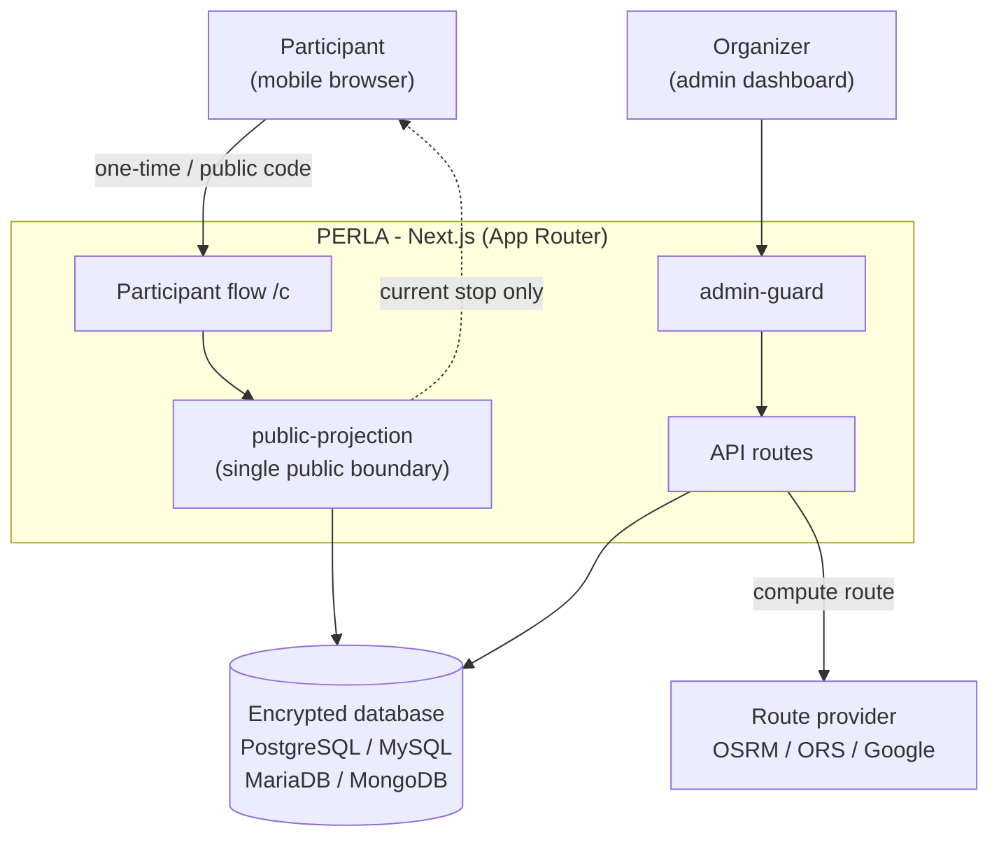

# PERLA — Private Encrypted Route & Location Access

Real-time, secure, anonymous location sharing — trackable only by organizers. Participants receive a code to access a multi-stop route with geolocation; sensitive data (coordinates, IP) is end-to-end encrypted.

<p align="center">
  
  
  
  
  
  <br>
  
  
  
  
</p>

Organizers create events with a **secret destination**, split them into **intermediate stops**, and share a **code** with each participant. The participant sees only the current stop on the map; the organizer tracks everyone in real time on a live dashboard. Typical use cases: treasure hunts, rallies, guided tours, surprise events, relay races.

## ✨ Features

| | Feature |
|---|---|
| 🔐 | **Encrypted** destination & waypoints — the participant only ever sees the current stop |
| 🎟️ | **One-time** device-bound codes **+ public codes** reusable by many people |
| 📡 | **Live dashboard** — each participant's position, stop and status in real time |
| 🛣️ | **Highway + toll** estimate on the route (free, per-event) |
| 🗺️ | Destinations in **Italy 🇮🇹 or Spain 🇪🇸**, with a region-silhouette location hint |
| 🌍 | **Multilingual** Italian / English / Spanish UI with a language switcher |
| 🖥️ | **Settings**, versioning and update checks |
| 🗄️ | 4 databases (PostgreSQL · MySQL · MariaDB · MongoDB) + setup wizard |
| ☁️ | **Vercel**-ready with an in-app guide and `.env` generator |

## 🏗️ Architecture



## 🚀 Quick start

```bash
npm install
cp .env.example .env
npm run db:generate
npm run dev
```

Open **http://localhost:3000** — on first run you're guided to the **`/admin/setup`** wizard (database + first admin). On Vercel the wizard is replaced by an in-app guide.

## 📚 Documentation

Full documentation lives in the **[Wiki](https://github.com/NetsukiiDev/Perla/wiki)**:

- [Getting Started](https://github.com/NetsukiiDev/Perla/wiki/Getting-Started) — install & first run
- [Configuration](https://github.com/NetsukiiDev/Perla/wiki/Configuration) — env vars, database, routing
- [Architecture](https://github.com/NetsukiiDev/Perla/wiki/Architecture) — diagrams & internals
- [Public Codes](https://github.com/NetsukiiDev/Perla/wiki/Public-Codes) · [Toll Estimate](https://github.com/NetsukiiDev/Perla/wiki/Toll-Estimate) · [Internationalization](https://github.com/NetsukiiDev/Perla/wiki/Internationalization) · [Versioning](https://github.com/NetsukiiDev/Perla/wiki/Versioning)
- [Deploy on Vercel](https://github.com/NetsukiiDev/Perla/wiki/Deploy-on-Vercel)
- [Security](https://github.com/NetsukiiDev/Perla/wiki/Security) — encryption & invariants
- [Troubleshooting](https://github.com/NetsukiiDev/Perla/wiki/Troubleshooting)

> Wiki sources are versioned in [`docs/wiki/`](docs/wiki) and published with [`scripts/publish-wiki.sh`](scripts/publish-wiki.sh).

## License

Proprietary. All rights reserved.
