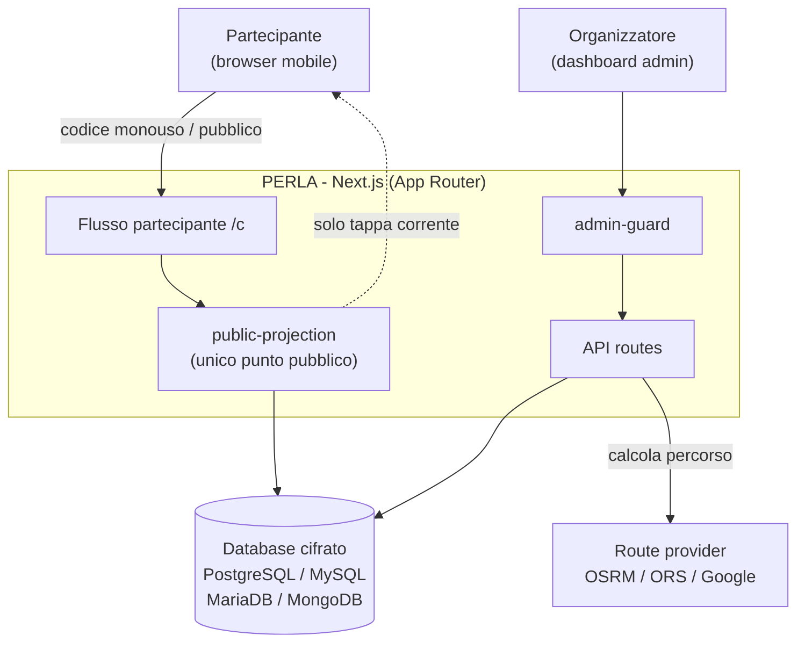
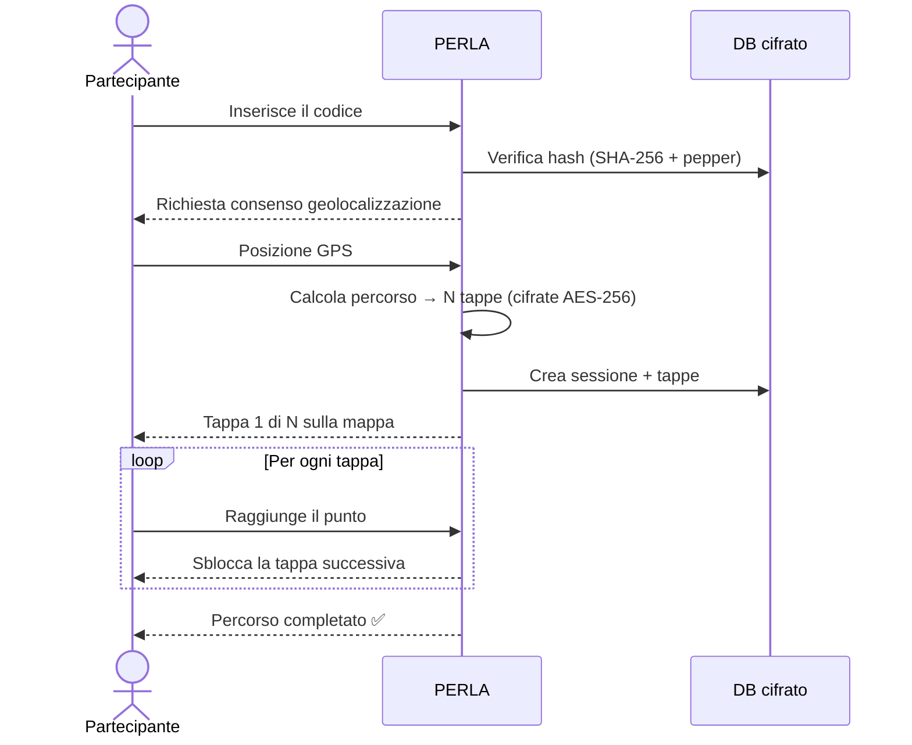

# PERLA — Private Encrypted Route & Location Access

Condivisione di posizioni in tempo reale, sicura, anonima e tracciabile solo dagli organizzatori. I partecipanti ricevono un codice monouso per accedere a un percorso a tappe con geolocalizzazione. I dati sensibili (coordinate, IP) sono cifrati end-to-end.

Real-time, secure, anonymous location sharing — trackable only by organizers. Participants receive a one-time code to access a multi-stop route with geolocation. Sensitive data (coordinates, IP) is end-to-end encrypted.

<p align="center">
  
  
  
  
  
  
  <br>
  
  
  
  
</p>

---

## ✨ Funzionalità · Features

| | Italiano | English |
|---|---|---|
| 🔐 | Destinazione **cifrata** e tappe intermedie: il partecipante vede solo la tappa corrente | **Encrypted** destination & waypoints: the participant only ever sees the current stop |
| 🎟️ | Codici **monouso** legati al dispositivo **+ codici pubblici** riusabili da più persone | **One-time** device-bound codes **+ public codes** reusable by many people |
| 📡 | **Dashboard live**: posizione, tappa e stato di ogni partecipante in tempo reale | **Live dashboard**: each participant's position, stop and status in real time |
| 🛣️ | Stima **autostrada + pedaggio** sul percorso (gratuita, per evento) | **Highway + toll** estimate on the route (free, per-event) |
| 🌍 | Interfaccia **bilingue** Italiano / English con selettore lingua | **Bilingual** Italian / English UI with a language switcher |
| 🖥️ | **Impostazioni**, versionamento e controllo aggiornamenti | **Settings**, versioning and update checks |
| 🗄️ | 4 database (PostgreSQL · MySQL · MariaDB · MongoDB) + wizard di setup | 4 databases (PostgreSQL · MySQL · MariaDB · MongoDB) + setup wizard |
| ☁️ | Pronto per **Vercel** con guida integrata e generatore `.env` | **Vercel**-ready with an in-app guide and `.env` generator |

## 🏗️ Architettura · Architecture



### Flusso partecipante · Participant flow



---

- [Italiano](#italiano)
  - [Panoramica](#panoramica)
  - [Stack tecnologico](#stack-tecnologico)
  - [Setup rapido](#setup-rapido)
  - [Primo avvio (wizard)](#primo-avvio-wizard)
  - [Database](#database)
  - [Provider di routing](#provider-di-routing)
  - [Variabili d'ambiente](#variabili-dambiente)
  - [Struttura del progetto](#struttura-del-progetto)
  - [Invarianti di sicurezza](#invarianti-di-sicurezza)
  - [Cron e retention](#cron-e-retention)
  - [Limiti noti](#limiti-noti)
- [English](#english)
  - [Overview](#overview)
  - [Tech stack](#tech-stack)
  - [Quick start](#quick-start)
  - [First run (wizard)](#first-run-wizard)
  - [Database](#database-1)
  - [Route providers](#route-providers)
  - [Environment variables](#environment-variables)
  - [Project structure](#project-structure)
  - [Security invariants](#security-invariants)
  - [Cron & retention](#cron--retention)
  - [Known limitations](#known-limitations)

---

## Italiano

### Panoramica

PERLA permette a un organizzatore di creare eventi con una destinazione segreta, suddividerli in tappe intermedie e condividere un codice monouso con ogni partecipante. Il partecipante inserisce il codice, viene autenticato tramite cookie dispositivo e vede solo la tappa corrente sulla mappa — senza sapere dove sono le tappe successive né la destinazione finale. L'organizzatore vede in tempo reale la posizione di tutti i partecipanti su una dashboard.

Casi d'uso tipici: cacce al tesoro, rally, escursioni guidate, eventi a sorpresa, staffette.

### Stack tecnologico

- **Framework:** Next.js (App Router) + React + TypeScript + Tailwind CSS
- **Database:** PostgreSQL, MySQL, MariaDB **oppure** MongoDB + Prisma ORM 7
- **Mappe:** Leaflet / react-leaflet (tile CARTO dark, nessuna API key)
- **Routing:** OSRM (default), openrouteservice, Google Routes
- **Auth admin:** Cookie firmato JWT (jose/HS256), password bcrypt
- **Criptografia:** AES-256-GCM per coordinate, SHA-256 + pepper per codici
- **i18n:** Italiano / English (cookie `locale` + dizionari tipizzati)
- **Rate limiting:** In-memory

### Setup rapido

```bash
npm install
cp .env.example .env
npm run db:generate
npm run dev       # con --webpack su Windows
```

### Primo avvio (wizard)

Finché il sito **non è configurato**, ogni pagina reindirizza a **`/admin/setup`**, un wizard in due passi:

1. **Database** — scegli il provider e inserisci i dati di connessione (manuale o stringa). Il sistema testa la connessione, crea lo schema (`prisma db push`) e salva la configurazione in `.data/config.json`.
2. **Amministratore** — crea il primo account admin e vieni autenticato automaticamente.

Una volta completato, il setup si disattiva. Da quel momento la homepage torna a mostrare solo il campo codice.

**Deploy serverless:** imposta `SETUP_DISABLED="true"` con `DATABASE_URL` e `DATABASE_PROVIDER` via env, poi crea l'admin con `npm run db:seed`.

### Database

| Provider | Variabile `DATABASE_PROVIDER` | Adapter |
|---|---|---|
| PostgreSQL | `postgresql` | `@prisma/adapter-pg` |
| MySQL | `mysql` | `@prisma/adapter-mariadb` |
| MariaDB | `mariadb` | `@prisma/adapter-mariadb` |
| MongoDB | `mongodb` | Nessuno (driver nativo) |

Per cambiare provider dopo l'avvio:

```bash
DATABASE_PROVIDER=mariadb npm run db:generate
DATABASE_PROVIDER=mariadb npm run db:migrate
```

> Nota MongoDB: lo schema Prisma viene trasformato a runtime (`scripts/prisma-provider.mjs`) per rimuovere `@db.*` e convertire `onDelete: SetNull` in `NoAction`. Il test connessione usa `MongoClient.ping()`.

### Provider di routing

Tutti i provider condividono l'interfaccia `RouteProvider` (`lib/route-provider/types.ts`). La suddivisione in tappe (`lib/route-steps.ts`) lavora sulla polyline reale restituita dal provider, non su una linea retta, e forza l'ultima tappa a coincidere con la destinazione cifrata.

| Provider | Variabile d'ambiente | Note |
|---|---|---|
| OSRM (default) | `OSRM_BASE_URL`, `OSRM_PROFILE` | Self-hosted o pubblico |
| openrouteservice | `OPENROUTESERVICE_*` | Richiede API key |
| Google Routes | `GOOGLE_ROUTES_*` | Richiede API key |

### Variabili d'ambiente

| Variabile | Scopo |
|---|---|
| `DATABASE_PROVIDER` | `postgresql` \| `mysql` \| `mariadb` \| `mongodb` (default `postgresql`) |
| `DATABASE_URL` | Connessione al database |
| `ENCRYPTION_KEY` | Chiave AES-256 (base64, 32 byte) per coordinate cifrate |
| `HASH_PEPPER` | Pepper per hash lookup dei codici monouso |
| `ADMIN_SESSION_SECRET` | Firma cookie sessione admin |
| `PARTICIPANT_SESSION_SECRET` | Firma cookie sessione partecipante |
| `ROUTE_PROVIDER` | `osrm` \| `openrouteservice` \| `google-routes` |
| `OSRM_BASE_URL` / `OSRM_PROFILE` | Endpoint OSRM |
| `OPENROUTESERVICE_API_KEY` / `*_BASE_URL` / `*_PROFILE` | Config openrouteservice |
| `GOOGLE_ROUTES_API_KEY` / `*_BASE_URL` / `*_TRAVEL_MODE` | Config Google Routes |
| `CRON_SECRET` | Bearer token per `/api/cron/retention` |
| `LOCATION_RETENTION_HOURS` | TTL posizioni temporanee (default 24h) |
| `SETUP_DISABLED` | `"true"` per bypassare il wizard (serverless/prod) |

### Struttura del progetto

```
├── app/
│   ├── page.tsx                    # Homepage pubblica (solo campo codice)
│   ├── (public)/
│   │   └── c/page.tsx              # Flusso partecipante
│   ├── admin/
│   │   ├── setup/page.tsx          # Wizard di setup
│   │   ├── login/page.tsx          # Login admin
│   │   ├── events/                 # Gestione eventi (+ codici pubblici, pedaggio)
│   │   ├── users/                  # Gestione utenti admin
│   │   ├── account/                # Profilo admin
│   │   └── settings/               # Impostazioni (lingua, versione, aggiornamenti)
│   └── api/                        # Route API
│       ├── code/                   # Risoluzione codice partecipante
│       ├── session/                # Sessione partecipante
│       ├── admin/                  # API admin
│       └── cron/                   # Retention e pulizia
├── components/                     # Componenti React
├── lib/                            # Librerie condivise
│   ├── crypto.ts                   # Cifratura AES-256-GCM
│   ├── hash.ts                     # SHA-256 + pepper
│   ├── admin-guard.ts              # Protezione route admin
│   ├── public-projection.ts        # Proiezione dati partecipante
│   ├── config.ts                   # Config runtime (.data/config.json)
│   ├── prisma-adapter.ts           # Selezione adapter runtime
│   ├── db-init.ts                  # Test connessione DB
│   ├── toll-estimate.ts            # Stima autostrada + pedaggio (euristica)
│   ├── version.ts                  # Versione + info build/commit
│   ├── i18n/                       # Dizionari IT/EN, provider e loader lingua
│   └── route-provider/             # Provider routing
│       ├── types.ts                # Interfaccia comune
│       ├── osrm.ts
│       ├── openrouteservice.ts
│       └── google-routes.ts
├── prisma/
│   └── schema.prisma               # Schema dati
├── scripts/
│   ├── prisma-provider.mjs         # Trasformazione schema a runtime
│   └── schema-mongodb.mjs          # Trasformatore standalone MongoDB
├── proxy.ts                        # Rewrite/redirect dev server
├── next.config.ts
├── vercel.json
├── VERSION
└── CHANGELOG.md
```

### Invarianti di sicurezza

Queste regole sono il cuore del progetto e vanno preservate in ogni modifica:

1. **Un solo punto di proiezione pubblica.** `lib/public-projection.ts` è l'unico modulo autorizzato a decidere cosa viene mostrato al partecipante. Decritta le coordinate solo per la tappa corrente. Qualsiasi nuova route o pagina pubblica deve passare da qui.
2. **Nessun dato tecnico/identificativo al partecipante.** Nome evento, nome partecipante, codice in chiaro, log e l'elenco completo delle tappe non vengono mai serializzati verso il client pubblico.
3. **Codici hash + cifratura admin.** `lib/hash.ts` salva SHA-256 + pepper per il lookup; `lib/crypto.ts` salva anche una copia AES-GCM recuperabile solo dalle API admin autenticate.
4. **Coordinate cifrate at-rest.** `lib/crypto.ts` cifra `destination_*`, `route_steps.*_encrypted`, `location_updates.*_encrypted`.
5. **Cookie.** `httpOnly`, `secure` in produzione, `sameSite` strict/lax. Il device token è un cookie httpOnly (non localStorage).
6. **L'IP non è mai un blocco rigido.** Viene solo hashato come dato tecnico di audit; il vincolo "un codice, un dispositivo" si basa sul device token.
7. **Niente promesse di anonimato assoluto.** Log minimi (`access_logs`) restano per audit; la retention automatica elimina i dati di posizione temporanei, non ogni traccia tecnica.

### Cron e retention

`/api/cron/retention` richiede `Authorization: Bearer <CRON_SECRET>`. Elimina posizioni scadute, posizioni di eventi chiusi/archiviati e sessioni attive dopo la chiusura dell'evento. `vercel.json` la programma una volta al giorno.

### Limiti noti

- **Rate limiting in-memory:** funziona su singola istanza. Per multi-istanza/serverless sostituire `lib/rate-limit.ts` con store condiviso (Upstash Redis, ecc.).
- **2FA admin:** schema predisposto (`totpSecret`/`totpEnabled`) ma verifica TOTP non ancora implementata.
- **Ruoli `admin`/`staff`:** gestione utenti (`/admin/users`) riservata a `admin`. Non puoi eliminare il tuo account né l'ultimo admin.
- **Mobile-first:** rigoroso sull'esperienza pubblica; dashboard admin desktop-first.

---

## English

### Overview

PERLA lets organizers create events with a secret destination, split them into intermediate stops, and share a one-time code with each participant. The participant enters the code, gets authenticated via a device cookie, and sees only the current stop on the map — without knowing subsequent stops or the final destination. The organizer sees all participants' positions in real time on a dashboard.

Typical use cases: treasure hunts, rallies, guided tours, surprise events, relay races.

### Tech stack

- **Framework:** Next.js (App Router) + React + TypeScript + Tailwind CSS
- **Database:** PostgreSQL, MySQL, MariaDB **or** MongoDB + Prisma ORM 7
- **Maps:** Leaflet / react-leaflet (CARTO dark tiles, no API key)
- **Routing:** OSRM (default), openrouteservice, Google Routes
- **Admin auth:** Signed JWT cookie (jose/HS256), bcrypt passwords
- **Encryption:** AES-256-GCM for coordinates, SHA-256 + pepper for codes
- **i18n:** Italian / English (locale cookie + typed dictionaries)
- **Rate limiting:** In-memory

### Quick start

```bash
npm install
cp .env.example .env
npm run db:generate
npm run dev       # add --webpack on Windows
```

### First run (wizard)

Until the site **is not configured**, every page redirects to **`/admin/setup`**, a two-step wizard:

1. **Database** — pick a provider and enter connection details (manual or connection string). The system tests the connection, creates the schema (`prisma db push`), and saves the config to `.data/config.json`.
2. **Administrator** — create the first admin account and get automatically authenticated.

Once completed, the setup deactivates. The homepage goes back to showing only the code input field.

**Serverless deployment:** set `SETUP_DISABLED="true"` with `DATABASE_URL` and `DATABASE_PROVIDER` via env, then create the admin with `npm run db:seed`.

### Database

| Provider | `DATABASE_PROVIDER` value | Adapter |
|---|---|---|
| PostgreSQL | `postgresql` | `@prisma/adapter-pg` |
| MySQL | `mysql` | `@prisma/adapter-mariadb` |
| MariaDB | `mariadb` | `@prisma/adapter-mariadb` |
| MongoDB | `mongodb` | None (native driver) |

To switch providers after first run:

```bash
DATABASE_PROVIDER=mariadb npm run db:generate
DATABASE_PROVIDER=mariadb npm run db:migrate
```

> MongoDB note: the Prisma schema is transformed at runtime (`scripts/prisma-provider.mjs`) to strip `@db.*` annotations and convert `onDelete: SetNull` to `NoAction`. Connection testing uses `MongoClient.ping()`.

### Route providers

All providers share the `RouteProvider` interface (`lib/route-provider/types.ts`). Waypoint splitting (`lib/route-steps.ts`) operates on the real polyline returned by the provider and forces the last stop to match the encrypted destination.

| Provider | Environment variables | Notes |
|---|---|---|
| OSRM (default) | `OSRM_BASE_URL`, `OSRM_PROFILE` | Self-hosted or public |
| openrouteservice | `OPENROUTESERVICE_*` | Requires API key |
| Google Routes | `GOOGLE_ROUTES_*` | Requires API key |

### Environment variables

| Variable | Purpose |
|---|---|
| `DATABASE_PROVIDER` | `postgresql` \| `mysql` \| `mariadb` \| `mongodb` (default `postgresql`) |
| `DATABASE_URL` | Database connection string |
| `ENCRYPTION_KEY` | AES-256 key (base64, 32 bytes) for encrypted coordinates |
| `HASH_PEPPER` | Pepper for one-time code hash lookup |
| `ADMIN_SESSION_SECRET` | Admin session cookie signing secret |
| `PARTICIPANT_SESSION_SECRET` | Participant session cookie signing secret |
| `ROUTE_PROVIDER` | `osrm` \| `openrouteservice` \| `google-routes` |
| `OSRM_BASE_URL` / `OSRM_PROFILE` | OSRM endpoint configuration |
| `OPENROUTESERVICE_API_KEY` / `*_BASE_URL` / `*_PROFILE` | openrouteservice configuration |
| `GOOGLE_ROUTES_API_KEY` / `*_BASE_URL` / `*_TRAVEL_MODE` | Google Routes configuration |
| `CRON_SECRET` | Bearer token for `/api/cron/retention` |
| `LOCATION_RETENTION_HOURS` | TTL for temporary positions (default 24h) |
| `SETUP_DISABLED` | `"true"` to bypass the setup wizard (serverless/prod) |

### Project structure

```
├── app/
│   ├── page.tsx                    # Public homepage (code input only)
│   ├── (public)/
│   │   └── c/page.tsx              # Participant flow
│   ├── admin/
│   │   ├── setup/page.tsx          # Setup wizard
│   │   ├── login/page.tsx          # Admin login
│   │   ├── events/                 # Event management (+ public codes, toll)
│   │   ├── users/                  # Admin user management
│   │   ├── account/                # Admin profile
│   │   └── settings/               # Settings (language, version, updates)
│   └── api/                        # API routes
│       ├── code/                   # Participant code resolution
│       ├── session/                # Participant session
│       ├── admin/                  # Admin APIs
│       └── cron/                   # Retention & cleanup
├── components/                     # React components
├── lib/                            # Shared libraries
│   ├── crypto.ts                   # AES-256-GCM encryption
│   ├── hash.ts                     # SHA-256 + pepper
│   ├── admin-guard.ts              # Admin route protection
│   ├── public-projection.ts        # Participant data projection
│   ├── config.ts                   # Runtime config (.data/config.json)
│   ├── prisma-adapter.ts           # Runtime adapter selection
│   ├── db-init.ts                  # DB connection test
│   ├── toll-estimate.ts            # Highway + toll estimate (heuristic)
│   ├── version.ts                  # Version + build/commit info
│   ├── i18n/                       # IT/EN dictionaries, provider & loader
│   └── route-provider/             # Route providers
│       ├── types.ts                # Common interface
│       ├── osrm.ts
│       ├── openrouteservice.ts
│       └── google-routes.ts
├── prisma/
│   └── schema.prisma               # Data schema
├── scripts/
│   ├── prisma-provider.mjs         # Runtime schema transformation
│   └── schema-mongodb.mjs          # Standalone MongoDB transformer
├── proxy.ts                        # Dev server rewrite/redirect
├── next.config.ts
├── vercel.json
├── VERSION
└── CHANGELOG.md
```

### Security invariants

These rules are the heart of the project and must be preserved in every change:

1. **Single public projection point.** `lib/public-projection.ts` is the only module authorized to decide what is shown to the participant. It decrypts coordinates only for the current stop. Any new public route or page must go through here.
2. **No technical/identifying data to the participant.** Event name, participant name, plaintext code, logs, and the full stop list are never serialized to the public client.
3. **Hash + admin-only encryption.** `lib/hash.ts` stores SHA-256 + pepper for code lookup; `lib/crypto.ts` also stores an AES-GCM copy recoverable only by authenticated admin APIs.
4. **Coordinates encrypted at rest.** `lib/crypto.ts` encrypts `destination_*`, `route_steps.*_encrypted`, `location_updates.*_encrypted`.
5. **Cookies.** `httpOnly`, `secure` in production, `sameSite` strict/lax. The device token is an httpOnly cookie (not localStorage).
6. **IP is never a hard block.** It is only hashed as audit data; the "one code, one device" constraint is based on the device token.
7. **No promises of absolute anonymity.** Minimal logs (`access_logs`) remain for audit; automatic retention cleans up temporary position data, not every technical trace.

### Cron & retention

`/api/cron/retention` requires `Authorization: Bearer <CRON_SECRET>`. It deletes expired positions, positions from closed/archived events, and sessions still active after event closure. `vercel.json` schedules it once daily.

### Deploy su Vercel

#### Prerequisiti
- Un database accessibile da internet (PostgreSQL, MariaDB/MySQL o MongoDB)
- Il progetto è già pronto per Vercel — `vercel.json` e `vercel-build` in `package.json` sono configurati

#### 1. Collegare il repository
1. Vai su [vercel.com](https://vercel.com) → **Add New Project**
2. Importa il repository `NetsukiiDev/Perla` (o il tuo fork)
3. Framework auto-rilevato → **Next.js**
4. **Build Command** — non serve sovrascriverlo, usa lo script `vercel-build` in `package.json`

#### 2. Environment variables (obbligatorie)
Imposta queste variabili nel dashboard Vercel (Settings → Environment Variables):

| Variabile | Valore |
|-----------|--------|
| `SETUP_DISABLED` | `true` |
| `DATABASE_PROVIDER` | `postgresql`, `mysql` o `mariadb` |
| `DATABASE_URL` | Connection string (vedi sotto) |
| `ENCRYPTION_KEY` | `openssl rand -base64 32` |
| `HASH_PEPPER` | `openssl rand -hex 32` |
| `ADMIN_SESSION_SECRET` | `openssl rand -hex 32` |
| `PARTICIPANT_SESSION_SECRET` | `openssl rand -hex 32` |
| `CRON_SECRET` | `openssl rand -hex 32` |
| `ROUTE_PROVIDER` | `osrm` (default) |

#### 3. Database
Il wizard di setup non funziona su Vercel (filesystem read-only). Devi preparare il database manualmente:

```bash
# 1. Imposta le env var del database di produzione
set DATABASE_PROVIDER=postgresql
set DATABASE_URL=postgresql://...

# 2. Genera il client Prisma
npm run db:generate

# 3. Crea le tabelle (puntando al DB di produzione)
npx prisma db push

# 4. Crea il primo admin (usa i valori che vuoi)
npx tsx prisma/seed.ts
```

> **⚠️ MariaDB su Vercel**: il server MariaDB deve accettare connessioni TCP remote. Aggiungi gli [IP ranges di Vercel](https://vercel.com/docs/security/firewall#ip-range) al firewall del tuo database. Se usi un provider cloud (Aiven, PlanetScale), di solito è già abilitato.

#### 4. Deploy
1. **Production Branch**: `master`
2. **Root Directory**: lascia vuoto (usa la root del progetto)
3. Clicca **Deploy**

Il deploy esegue automaticamente: `prisma-provider.mjs` → `prisma generate` → `next build`.

#### 5. Dopo il deploy
1. Vai a `https://<progetto>.vercel.app/admin/login`
2. Accedi con le credenziali create con `seed.ts`
3. Crea il primo evento

#### Risoluzione problemi

| Errore | Causa | Soluzione |
|--------|-------|-----------|
| `ECONNRESET` / `Connessione fallita` | Database non raggiungibile da Vercel | Apri il firewall o usa un DB cloud |
| `ENOENT: schema.prisma` | File tracing mancante | Usa l'ultima `next.config.ts` (già configurata) |
| `DATABASE_URL not set` | `SETUP_DISABLED=true` ma `DATABASE_URL` mancante | Imposta la variabile in Vercel |
| `prisma generate` fallisce | Provider non corrispondente | Controlla `DATABASE_PROVIDER` |

#### Limiti su Vercel
- **Rate limiting in memoria** (`lib/rate-limit.ts`) — non condiviso tra istanze. Per produzione con molto traffico, sostituisci con Upstash Redis.
- **Cron job** — `vercel.json` programma la retention alle 4:00 UTC. Il cron invia `Authorization: Bearer <CRON_SECRET>`.

### Deploy on Vercel (English)

#### Prerequisites
- A database accessible from the internet (PostgreSQL, MariaDB/MySQL or MongoDB)
- The project is already Vercel-ready — `vercel.json` and `vercel-build` in `package.json` are preconfigured

#### 1. Connect the repository
1. Go to [vercel.com](https://vercel.com) → **Add New Project**
2. Import the `NetsukiiDev/Perla` repository (or your fork)
3. Framework auto-detected → **Next.js**
4. **Build Command** — no override needed; the `vercel-build` script in `package.json` is used automatically

#### 2. Environment variables (required)
Set these in the Vercel dashboard (Settings → Environment Variables):

| Variable | Value |
|----------|-------|
| `SETUP_DISABLED` | `true` |
| `DATABASE_PROVIDER` | `postgresql`, `mysql` or `mariadb` |
| `DATABASE_URL` | Connection string (see below) |
| `ENCRYPTION_KEY` | `openssl rand -base64 32` |
| `HASH_PEPPER` | `openssl rand -hex 32` |
| `ADMIN_SESSION_SECRET` | `openssl rand -hex 32` |
| `PARTICIPANT_SESSION_SECRET` | `openssl rand -hex 32` |
| `CRON_SECRET` | `openssl rand -hex 32` |
| `ROUTE_PROVIDER` | `osrm` (default) |

#### 3. Database
The setup wizard does NOT work on Vercel (read-only filesystem). You must prepare the database manually:

```bash
# 1. Set production database env vars
export DATABASE_PROVIDER=postgresql
export DATABASE_URL=postgresql://...

# 2. Generate Prisma client
npm run db:generate

# 3. Create tables (pointing to the production DB)
npx prisma db push

# 4. Create the first admin
npx tsx prisma/seed.ts
```

> **⚠️ MariaDB on Vercel**: the MariaDB server must accept remote TCP connections. Add [Vercel IP ranges](https://vercel.com/docs/security/firewall#ip-range) to your database firewall. Cloud providers (Aiven, PlanetScale) usually allow this by default.

#### 4. Deploy
1. **Production Branch**: `master`
2. **Root Directory**: leave blank (use project root)
3. Click **Deploy**

The build automatically runs: `prisma-provider.mjs` → `prisma generate` → `next build`.

#### 5. After deploy
1. Go to `https://<project>.vercel.app/admin/login`
2. Login with the credentials created by `seed.ts`
3. Create your first event

#### Troubleshooting

| Error | Cause | Fix |
|-------|-------|-----|
| `ECONNRESET` / connection failed | Database not reachable from Vercel | Open firewall or use a cloud DB |
| `ENOENT: schema.prisma` | Missing file tracing | Use the latest `next.config.ts` (already configured) |
| `DATABASE_URL not set` | `SETUP_DISABLED=true` but `DATABASE_URL` missing | Set the variable in Vercel |
| `prisma generate` fails | Provider mismatch | Check `DATABASE_PROVIDER` |

#### Limitations on Vercel
- **In-memory rate limiting** (`lib/rate-limit.ts`) — not shared across instances. For high-traffic production, replace with Upstash Redis.
- **Cron job** — `vercel.json` schedules retention at 4:00 UTC. The cron sends `Authorization: Bearer <CRON_SECRET>`.

---

### Known limitations

- **In-memory rate limiting:** works on single-instance deployments. For multi-instance/serverless, replace `lib/rate-limit.ts` with a shared store (Upstash Redis, etc.).
- **Admin 2FA:** schema is ready (`totpSecret`/`totpEnabled`) but TOTP verification is not yet implemented.
- **`admin`/`staff` roles:** user management (`/admin/users`) is reserved for `admin`. You cannot delete your own account or the last admin.
- **Mobile-first:** strictly enforced on the public experience; admin dashboard is desktop-first.

---

## License

Proprietary. All rights reserved.
