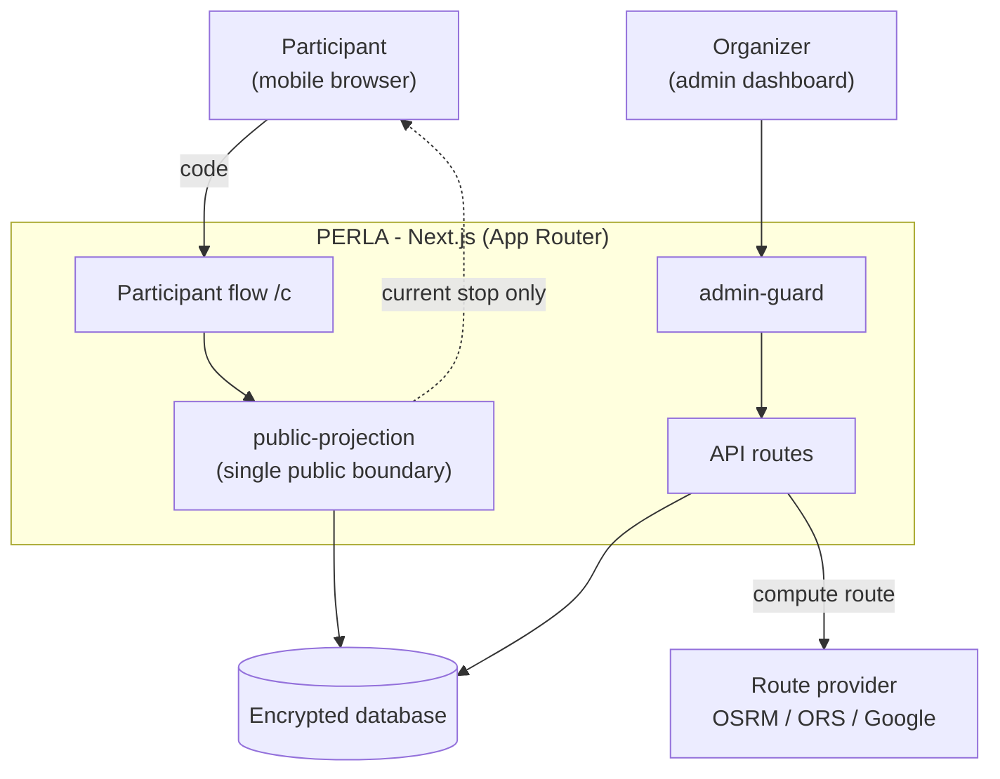
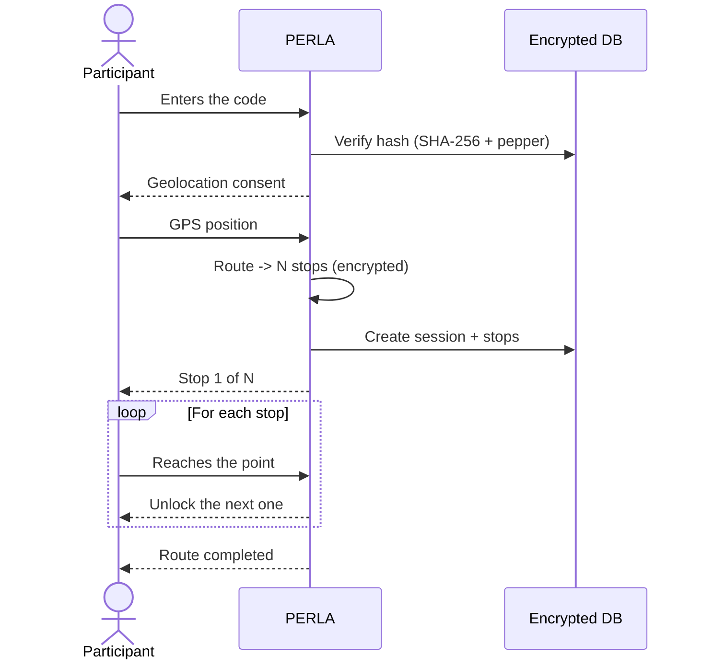

# Architecture

## System



## Participant flow



## Key modules

| Module | Responsibility |
|---|---|
| `lib/public-projection.ts` | **The only** module that decides what the participant sees; decrypts the current stop only |
| `lib/code-resolution.ts` | Resolves a code → state (one-time vs public, per-device) |
| `lib/crypto.ts` | AES-256-GCM for coordinates |
| `lib/hash.ts` | SHA-256 + pepper for code lookup |
| `lib/admin-guard.ts` | Protects admin routes/pages |
| `lib/route-provider/` | Routing provider abstraction |
| `lib/i18n/` | IT/EN dictionaries + language provider |
| `proxy.ts` | HTTPS enforcement in prod + `/admin/*` gating |

## Project structure

```
├── app/
│   ├── page.tsx                    # Public homepage (code input only)
│   ├── (public)/c/page.tsx         # Participant flow
│   ├── admin/
│   │   ├── setup/                  # Setup wizard / Vercel guide
│   │   ├── login/                  # Admin login
│   │   ├── events/                 # Event management (+ public codes, toll)
│   │   ├── users/                  # Admin user management
│   │   ├── account/                # Admin profile
│   │   └── settings/               # Settings (language, version, updates)
│   └── api/                        # code · session · admin · cron · settings
├── components/                     # React components
├── lib/
│   ├── crypto.ts                   # AES-256-GCM
│   ├── hash.ts                     # SHA-256 + pepper
│   ├── public-projection.ts        # Participant data projection
│   ├── code-resolution.ts          # Code → state resolution
│   ├── config.ts                   # Runtime config (.data/config.json)
│   ├── toll-estimate.ts            # Highway + toll estimate
│   ├── version.ts                  # Version + build/commit info
│   ├── i18n/                       # IT/EN dictionaries, provider & loader
│   └── route-provider/             # osrm · openrouteservice · google-routes
├── prisma/schema.prisma            # Data schema
├── scripts/                        # prisma-provider, publish-wiki, ...
├── proxy.ts · next.config.ts · vercel.json · CHANGELOG.md
```

## Security invariants

See the dedicated page: **[Security](Security)**.

## Known limitations

- **In-memory rate limiting** (`lib/rate-limit.ts`) — single-instance only. For multi-instance/serverless, replace with a shared store (e.g. Upstash Redis).
- **Admin 2FA** — schema is ready (`totpSecret`/`totpEnabled`) but TOTP verification is not implemented yet.
- **Roles `admin`/`staff`** — user management (`/admin/users`) is admin-only; you cannot delete your own account or the last admin.
- **Mobile-first** on the public experience; the admin dashboard is desktop-first.
