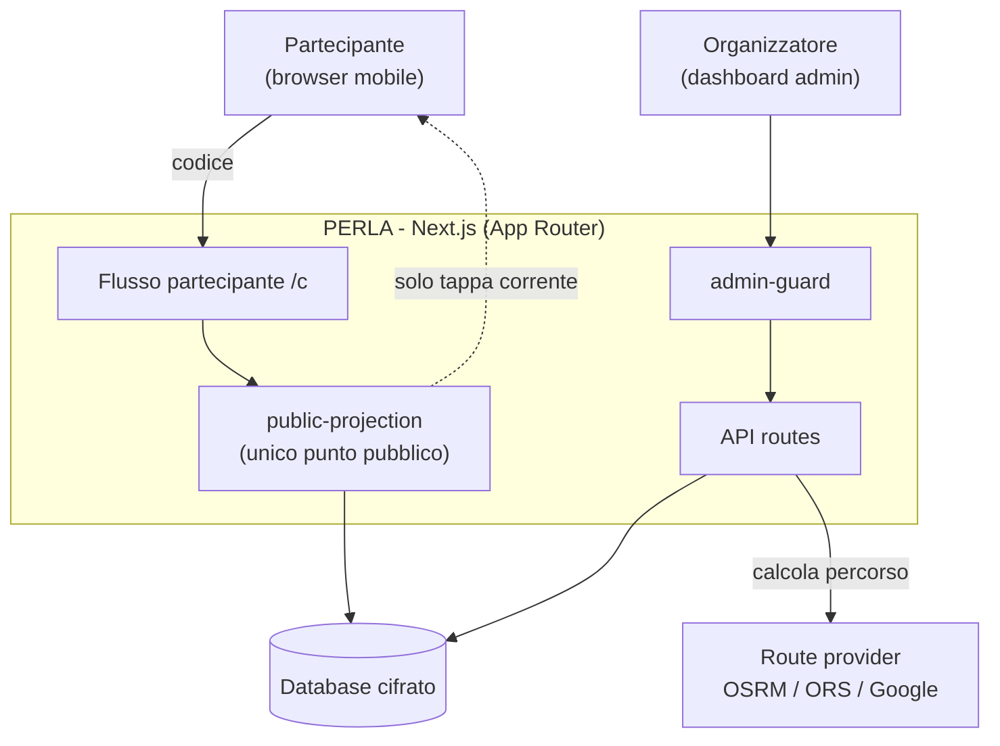
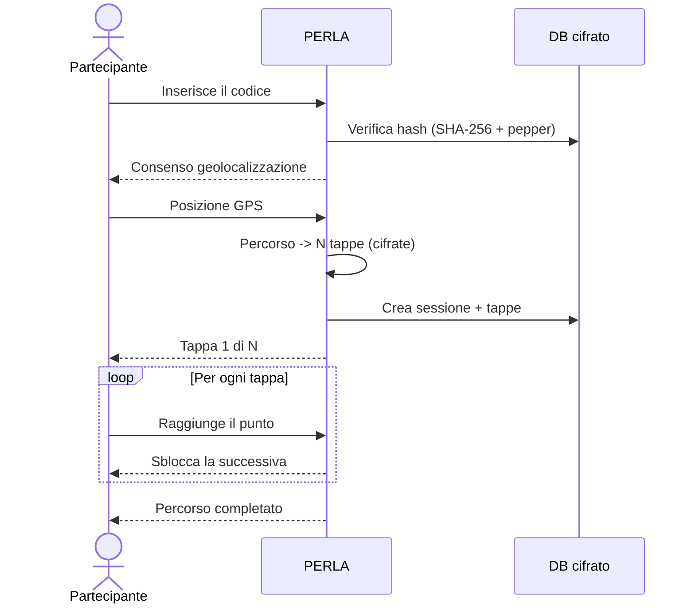

# Architecture

## Sistema

## Flusso partecipante

## Componenti chiave

| Modulo | Responsabilità |
|---|---|
| `lib/public-projection.ts` | **Unico** punto che decide cosa vede il partecipante; decritta solo la tappa corrente |
| `lib/code-resolution.ts` | Risoluzione codice → stato (monouso vs pubblico, per-dispositivo) |
| `lib/crypto.ts` | AES-256-GCM per le coordinate |
| `lib/hash.ts` | SHA-256 + pepper per il lookup dei codici |
| `lib/admin-guard.ts` | Protezione delle route/pagine admin |
| `lib/route-provider/` | Astrazione dei provider di routing |
| `lib/i18n/` | Dizionari IT/EN + provider lingua |
| `proxy.ts` | Enforce HTTPS in prod + gate delle route `/admin/*` |

## Invarianti di sicurezza

Vedi la pagina dedicata: **[Security](Security)**. In sintesi: un solo punto di proiezione pubblica, nessun dato identificativo verso il partecipante, coordinate cifrate at-rest, codici hashati, cookie `httpOnly`, l'IP non è mai un blocco rigido.
